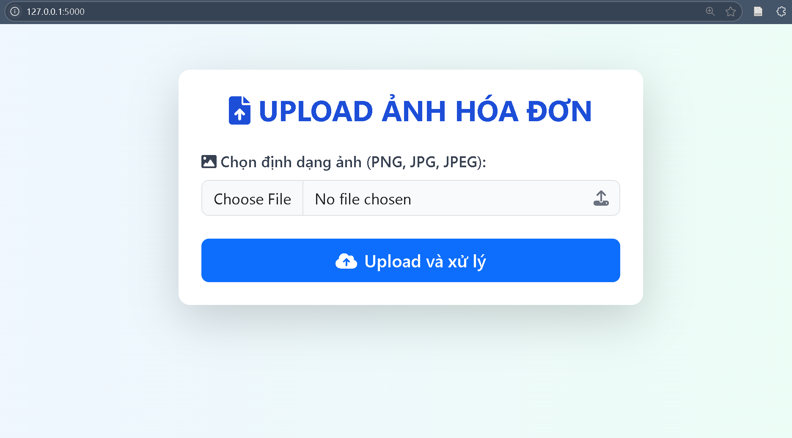
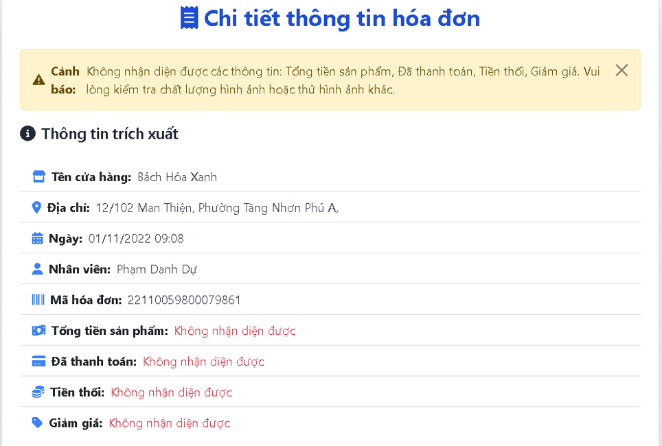
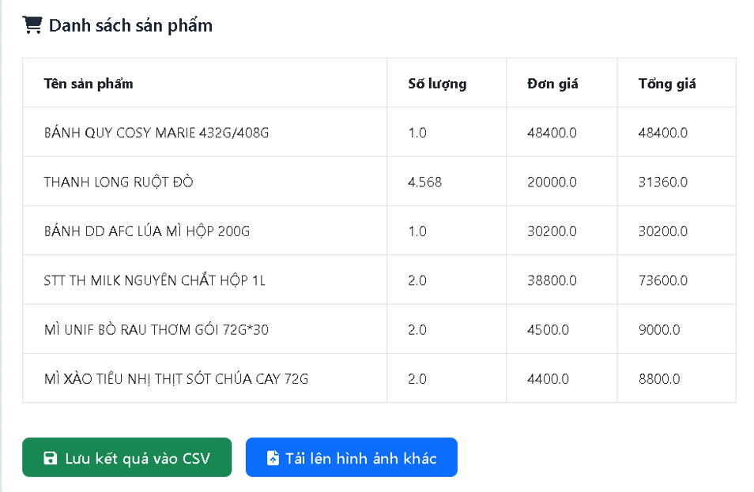

# 🧠 AI Invoice Recognition and Storage Automation  
*(Ứng dụng Trí Tuệ Nhân Tạo trong Nhận Diện và Tự Động Hóa Lưu Trữ Hóa Đơn)*  

  
  
  
  

This project builds an automated system to extract structured information from retail invoices using OCR technology, helping businesses optimize financial and accounting workflows.  
*(Đồ án này xây dựng một hệ thống tự động trích xuất thông tin có cấu trúc từ hóa đơn bán lẻ bằng công nghệ OCR, giúp doanh nghiệp tối ưu hóa quy trình tài chính và kế toán.)*  

---

## 📋 Table of Contents *(Mục lục)*  

- [🎯 Objectives & Significance *(Mục tiêu & Ý nghĩa)*](#-objectives--significance-mục-tiêu--ý-nghĩa)  
- [🛠️ Technologies Used *(Công nghệ sử dụng)*](#-technologies-used-công-nghệ-sử-dụng)  
- [📊 Dataset *(Dữ liệu)*](#-dataset-dữ-liệu)  
- [⚙️ System Workflow *(Quy trình hoạt động của hệ thống)*](#-system-workflow-quy-trình-hoạt-động-của-hệ-thống)  
- [📈 Experimental Results *(Kết quả thực nghiệm)*](#-experimental-results-kết-quả-thực-nghiệm)  
- [🖥️ User Interface *(Giao diện hệ thống)*](#-user-interface-giao-diện-hệ-thống)  
- [🚀 Conclusion & Future Work *(Kết luận & Hướng phát triển)*](#-conclusion--future-work-kết-luận--hướng-phát-triển)  
- [⚙️ Installation *(Cài đặt)*](#️-installation-cài-đặt)  
- [👥 Project Information *(Thông tin Đồ án)*](#-project-information-thông-tin-đồ-án)  

---

## 🎯 Objectives & Significance *(Mục tiêu & Ý nghĩa)*  

### Objectives *(Mục tiêu)*  
- **General:** Develop a complete system enabling automatic extraction, analysis, and management of invoice data using OCR and machine learning.  
  *(Tổng quan: Xây dựng một hệ thống hoàn chỉnh giúp doanh nghiệp trích xuất, phân tích và quản lý dữ liệu hóa đơn hiệu quả bằng OCR và học máy.)*  

- **Specific:** Apply **Tesseract OCR** combined with **OpenCV** image processing techniques to extract invoice information with optimized speed and accuracy.  
  *(Cụ thể: Áp dụng OCR (Tesseract) kết hợp các kỹ thuật xử lý ảnh (OpenCV) để trích xuất dữ liệu từ ảnh hóa đơn với độ chính xác và tốc độ tối ưu.)*  

### Practical Significance *(Ý nghĩa thực tiễn)*  
The system serves as an intelligent automation tool that helps businesses:  
*(Hệ thống hoạt động như một công cụ tự động thông minh giúp doanh nghiệp:)*  
- Save time and reduce manual data entry effort. *(Tiết kiệm thời gian và nhân lực nhập liệu thủ công.)*  
- Minimize financial data errors. *(Giảm thiểu sai sót trong quá trình xử lý dữ liệu tài chính.)*  
- Optimize invoice archiving and retrieval. *(Tối ưu hóa quy trình lưu trữ và tra cứu hóa đơn.)*  
- Provide clean structured data for analytics and decision-making. *(Cung cấp dữ liệu sạch phục vụ phân tích và ra quyết định chiến lược.)*  

---

## 🛠️ Technologies Used *(Công nghệ sử dụng)*  

| Category | Tools & Libraries |
|-----------|------------------|
| **Programming Language** | Python 3.9 |
| **Image Processing** | OpenCV |
| **Optical Character Recognition (OCR)** | Tesseract (language: `vie`) |
| **Information Extraction** | Regex (Regular Expressions) |
| **Web Framework** | Flask |
| **Supporting Libraries** | Pandas, NumPy |

*(Bảng trên liệt kê các công nghệ và thư viện chính được sử dụng trong hệ thống, bao gồm Python, OpenCV, Tesseract OCR, và Flask cho giao diện web demo.)*  

---

## 📊 Dataset *(Dữ liệu)*  

- **Source:** Roboflow Platform  
- **Objects:** 28 invoice images from *Bách Hóa Xanh* retail stores  
- **Format:** JPG, PNG  
- **Language:** Vietnamese  
- **Quality:** Mixed — clear, blurred, skewed, and low-light images  

**Extracted Fields (10 key attributes):**  
1. Store Name *(Tên cửa hàng)*  
2. Address *(Địa chỉ)*  
3. Date *(Ngày giao dịch)*  
4. Employee *(Nhân viên)*  
5. Bill No *(Số hóa đơn)*  
6. Products *(Danh sách sản phẩm)*  
7. Total Products *(Tổng tiền sản phẩm)*  
8. Paid *(Số tiền thanh toán)*  
9. Change *(Tiền thối)*  
10. Discount *(Giảm giá)*  

---

## ⚙️ System Workflow *(Quy trình hoạt động của hệ thống)*  

The system processes invoice images through three main stages:  
*(Hệ thống xử lý ảnh hóa đơn qua ba giai đoạn chính:)*  

### 1. Image Preprocessing *(Tiền xử lý ảnh – OpenCV)*  
The input image undergoes several enhancement steps to optimize OCR performance:  
*(Ảnh đầu vào được xử lý qua nhiều bước để tối ưu hóa khả năng nhận diện OCR:)*  

1. Convert to grayscale *(Chuyển ảnh sang thang xám)*  
2. Deskew image *(Chỉnh lại góc nghiêng)*  
3. Remove background noise *(Khử nhiễu nền)*  
4. Apply Otsu Thresholding *(Ngưỡng hóa nhị phân Otsu)*  
5. Morphological operations *(Xử lý hình thái học)*  
6. Resize for better OCR accuracy *(Phóng to ảnh để cải thiện độ chính xác OCR)*  

---

### 2. OCR Strategy *(Chiến lược OCR – Tesseract)*  
The system applies a **multi-stage fallback strategy** to maximize recognition accuracy.  
*(Hệ thống áp dụng chiến lược OCR nhiều tầng để tối đa hóa độ chính xác nhận diện.)*  

1. **Full Image OCR:** Run Tesseract on the entire preprocessed image.  
2. **Quality Check:** Evaluate missing fields.  
3. **Fallback Strategy:** If more than 3 key fields are missing, the system switches to segment-based OCR (cropping the image into overlapping slices and merging results).  

*(Hệ thống chạy Tesseract trên toàn ảnh, sau đó kiểm tra số trường bị thiếu. Nếu vượt quá 3, chuyển sang chế độ nhận diện từng vùng ảnh chồng lấn để tăng độ chính xác.)*  

---

### 3. Information Extraction *(Trích xuất thông tin – Regex)*  
Extract structured invoice data using **regular expressions** designed specifically for *Bách Hóa Xanh* receipts.  
*(Sử dụng các mẫu biểu thức chính quy được thiết kế riêng cho hóa đơn Bách Hóa Xanh để trích xuất và định dạng lại thông tin có cấu trúc.)*  

---

## 📈 Experimental Results *(Kết quả thực nghiệm)*  

Performance on 28 real invoice images:  
*(Hiệu suất được đánh giá trên 28 ảnh hóa đơn thực tế:)*  

| Evaluation Result | Image Count | Rate | Description |
|:------------------|:------------:|:----:|:-------------|
| **Good / Fair** | 13 / 28 | 46.5% | Accurate recognition (70–85%) |
| **Average / Poor** | 10 / 28 | 35.7% | Partial recognition, inconsistent accuracy |
| **Failed** | 5 / 28 | 17.9% | No data recognized (blurry or noisy images) |

> ⚠️ **Critical Issue:** Field `Total_products` failed in 100% of cases. Financial fields like `Paid` and `Change` achieved only 28–35% accuracy.  
> *(Lỗi nghiêm trọng: Trường “Tổng tiền sản phẩm” thất bại hoàn toàn (100%), các trường tài chính như “Số tiền thanh toán” và “Tiền thối” chỉ đạt 28–35%.)*  

---

## 🖥️ User Interface *(Giao diện hệ thống)*  

The system is implemented as a lightweight **Flask Web App**.  
*(Hệ thống được triển khai dưới dạng ứng dụng web đơn giản bằng Flask.)*  

- **Upload Function:** Users can upload invoice images directly.  
  *(Chức năng tải ảnh hóa đơn trực tiếp lên giao diện.)*  

  

- **Result Display:** Extracted information is shown clearly and organized.  
  *(Hiển thị kết quả trích xuất dưới dạng bảng rõ ràng và có cấu trúc.)*  

  
  

- **Error Highlighting:** Missing fields are shown in **red**.  
  *(Các trường thiếu được đánh dấu đỏ để dễ kiểm tra.)*  

- **Auto Save:** Results are automatically stored in `results.csv` for further analysis.  
  *(Kết quả được tự động lưu vào file `results.csv` phục vụ phân tích sau.)*  

---

## 🚀 Conclusion & Future Work *(Kết luận & Hướng phát triển)*  

### Conclusion *(Kết luận)*  
The system successfully automates the invoice recognition process, achieving 75–85% accuracy on high-quality images.  
*(Hệ thống tự động hóa thành công quy trình nhận diện hóa đơn, đạt độ chính xác 75–85% với ảnh chất lượng tốt.)*  

However, OCR accuracy on financial fields and low-quality images remains limited.  
*(Tuy nhiên, hệ thống còn yếu ở các trường tài chính và ảnh mờ, nhiễu.)*  

### Future Work *(Hướng phát triển)*  
1. Expand dataset with various invoice formats. *(Mở rộng tập dữ liệu với nhiều loại hóa đơn hơn.)*  
2. Apply deep learning models (CRNN, CTPN, Vision-Language). *(Áp dụng mô hình học sâu để nâng cao độ chính xác.)*  
3. Improve preprocessing pipeline. *(Cải thiện thuật toán tiền xử lý ảnh.)*  
4. Add manual correction on web interface. *(Thêm chức năng chỉnh sửa thủ công trên giao diện web.)*  

---

## ⚙️ Installation *(Cài đặt)*  

> *(Phần này bạn sẽ tự viết hướng dẫn thiết lập môi trường và chạy project tại đây.)*

---

## 👥 Project Information *(Thông tin Đồ án)*  

This project was developed as part of the **Fundamental Project (Đồ án Cơ sở)** – Semester 1, Academic Year 2024–2025.  
*(Đây là sản phẩm của Đồ án Cơ sở – Học kỳ 1, năm học 2024–2025.)*  

**Students:**  
- Hồ Gia Thành  
- Huỳnh Thái Linh  
- Trương Minh Khoa  

**Class:** `22DKHA1` – *Data Science Major (Khoa học Dữ liệu)*  
**Instructor:** MSc. Nguyễn Quang Phúc  
**University:** HUTECH – Ho Chi Minh City University of Technology (2025)  
